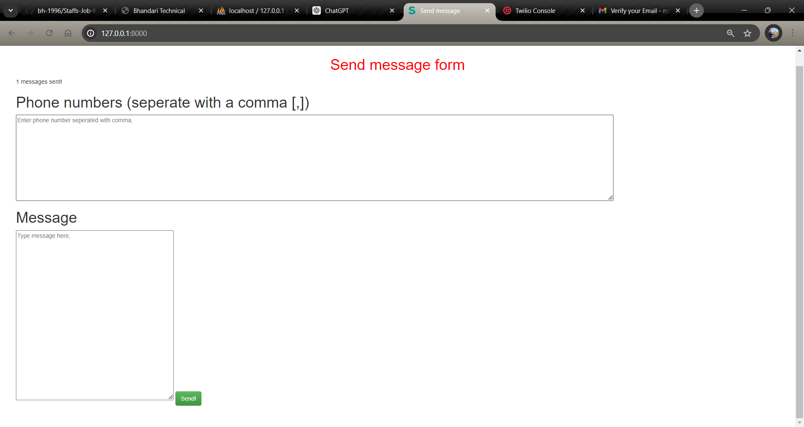

### Auther : MBK Bhandari ( https://www.linkedin.com/in/mbk-9852/ )




# Send Message with Twilio SDK in Laravel
# Send-MSM-Twillio
This Laravel project demonstrates how to integrate Twilio SDK to send SMS messages and initiate voice calls. The application includes a form where users can input multiple phone numbers and a message, and then send the message to all the provided phone numbers. Additionally, the application allows users to initiate voice calls.

**Send-sms-twilli** This Laravel project demonstrates how to integrate the Twilio SDK to send SMS messages to multiple recipients. The application includes a simple form where users can input phone numbers and a message to be sent.

**Overview** The "Send Message" feature allows users to send SMS messages to a list of phone numbers using the Twilio API. This can be useful for notifications, alerts, or any form of bulk messaging.

## Features

- **Bulk SMS Sending:** Send messages to multiple phone numbers separated by commas
- **Twilio Integration:** Seamless integration with Twilio for reliable message delivery.
- **Simple UI:** A straightforward form for inputting phone numbers and the message..

## Prerequisites
- PHP >= 7.4
- Composer
- Laravel Framework
- Twilio Account

## Installation

To get a local copy up and running, follow these simple steps:

1. **Clone the repository:**

   ```bash
   git clone git@github.com:bh-1996/Send-MSM-Twillio.git

2. Navigate to the project directory:
    ```bash
    cd Send-MSM-Twillio

3. Install dependencies:
    ```bash
    composer install

4. Copy .env.example to .env and configure your environment variables:
    ```bash
    cp .env.example .env

5. Generate application key:
    ```bash
    php artisan key:generate

6. Run database migrations:
    ```bash
   php artisan migrate

7. Serve the application:
    ```bash
    php artisan serve


